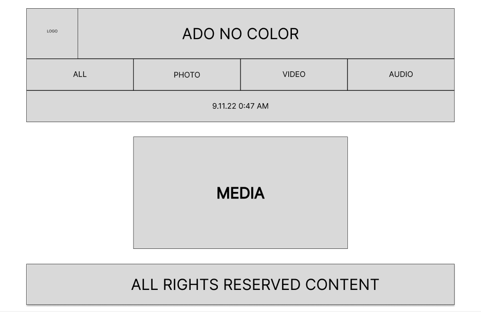

# Web-Sem-5

## Иванов Максим Игоревич. M33081.

## Лабораторная работа 1:

> _Выбранная тема:_ визитная карточка с элементами блога.

### Цель работы:

> Данная лабораторная подразумевает создание макета сайта без использования знаний CSS,
> только HTML. Создаем сайт резюме - портфолио. Главная задача данной лабораторной работы -
> ознакомиться с наиболее значимыми тегами и правилами их использования.

### [Макет:](https://www.figma.com/file/Hojq5EKqZPEdexlVdJsmOO/Ado-No-Color-Portfolio's-site?node-id=0%3A1)

